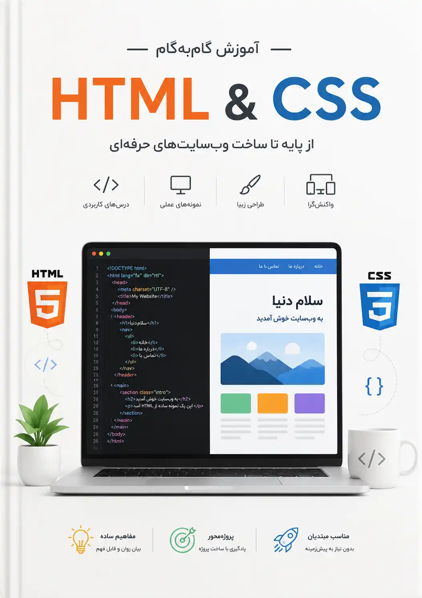

# پیشگفتار {.unnumbered}
<!-- Preface -->
هدف از نگارش این کتاب آشنایی تخصصی با HTML و مکمل‌های آن یعنی CSS و JavaScript است. به دلیل گستردگی مبحث جاوا اسکریپت  بعد از صحبت درباره این دو پیش نیاز درباره آن در کتاب دیگری صحبت خواهیم کرد. HTML-CSS اهمیت زیادی دارند چون وب‌سایت‌ها تبدیل به یکی از مهم‌ترین رابط‌ها شده‌اند و مرورگرها عضو جدایی ناپذیر سیستم‌های عامل شده‌اند و رقابت سختی بین آنها فراگیر شده تا تبدیل به مرورگر پیش فرض کاربران شوند.

بدون توجه به اینکه در کدام حوزه فناوری اطلاعات در حال
[توسعه فردی](https://roadmap.sh/)
 خود هستید HTML-CSS در عصر حاضر قسمتی از اطلاعات عمومی شما خواهند بود در صورتی که زمانی فقط طراحان وب به این مباحث نیاز حیاتی داشتند. آشنایی با آنها شما را قادر می‌سازد به پتانسیل بالقوه آنها آگاهی پیدا کنید. فردی که در حوزه IT فعالیت می‌کند باید به این توانایی‌ها آشنایی داشته باشد تا جعبه ابزار کامل‌تری در اختیار داشته باشد.

این کتاب به درد چه کسانی می‌خوره؟

- مبتدیان جسور

  افرادی که به تازگی وارد دنیای برنامه‌نویسی وب شده‌اند. همه آنچه درباره HTML-CSS باید بدانند در این کتاب وجود دارد.

- Backend Developers

  برنامه‌نویسانی که معمولاً با سرور و پایگاه داده کار می‌کنند و قصد دارند یک آشنایی سریع و کاربردی با بخش Front پیدا کنند. اگر xaml یا razor و … را دیده باشید خواهید دید که به عنوان یک توسعه دهنده سمت سرور باید به عنوان بخشی از مبانی وب با این دو مبحث آشنا باشید.

- Frontend developers
- طراحان وب
- کسانی که به دنبال مرجع به روز هستند

  در این کتاب سعی شده به روزترین تغییرات حوزه HTML-CSS همواره گردآوری شده و در دسترس متخصصین این حوزه قرار گیرد. مطالب قبلی بر اساس این تغییرات به روز نگه داشته می‌شوند تا آخرین تغییرات مرورگرها و جدیدترین قابلیت‌های این دو حوزه در اختیار شما قرار گیرند.

این کتاب برای چه کسانی نیست:
اگر به دنبال کتابی هستید که صرفاً تگ‌های HTML را لیست کرده باشد، این کتاب برای شما نیست. اما اگر می‌خواهید وب‌سایتی بسازید که در موبایل و دسکتاپ عالی دیده شود، با سیستم‌عامل کاربر هماهنگ بشه و رفتارهای هوشمندانه داشته باشد، خوش آمدید! این کتاب برای شما نوشته شده است.
از قابلیت‌های Git روی پروژه‌های مرتبط با HTML و CSS نیز می‌توان استفاده کرد. برای آشنایی با Git 
[این کتاب](https://docs.google.com/document/d/1A13cY3E68Fkwm99M8EopNOU3njukQOxHsjsHXvvTSvs/edit?tab=t.0)
 را مطالعه بفرمایید.
یکی دیگر از ابزارهای مفید در این حوزه Developer tools مرورگرها است. برای آشنایی با آن از 
[این کتاب](https://docs.google.com/document/d/1HIPhxZSNIG8TZAbeFuuqap98xHlXUrjdPoaoGinG2z0/edit?tab=t.0)
استفاده کنید.

