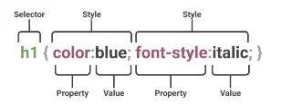

# انتخابگرها
برای تعین سبک و سیاق نمایش یک شی اول باید آن را انتخاب کنیم:



در شکل فوق h1 های صفحه انتخاب شده اند و برای آنها به صورت یکجا خاصیت های فوق تنظیم شده.

بعد از select کردن باید property را مشخص کرد و به آن Value داد. به روش های مختلفی می توانیم شی و یا رویداد مورد نظر خود را انتخاب کنیم.

## ساده

**element Selector**

خاصیت های داخل آن روی کل عناصر سایت اعمال می‌شود:

```css
p {
  text-align: center;
  color: red;
}
```

**id Selector**

انتخابگر شناسه CSS بر اساس مقدار ویژگی id عنصر، آن را انتخاب می‌کند. برای اینکه عنصر انتخاب شود، ویژگی id آن باید دقیقاً با مقداری که در انتخابگر داده شده است، مطابقت داشته باشد.

```css
#para1 {
  text-align: center;
  color: red;
}
```
ID نباید حاوی space باشد و نباید با عدد شروع شود.

**class Selector**

خاصیت های داخل آن برای یک کلاس اعمال می‌شود

```css
.center {
    text-align: center;
    color: red;
}
```

همچنین می توان به روش زیر تگ هایی که کلاس خاصی دارند انتخاب کرد:

```css
p.container {
    Color: black;
}
```

**Universal Selector**

همه اجزای داخل html را انتخاب میکند.

```css
* {
  text-align: center;
  color: blue;
}
```

::: {.callout-note}
 نکته مهم: اگر یکی از این خواص هم در id ستاره وجود داشته باشد هم در id مستقیم آن شی اولویت با id داخل شی خواهد بود. مثلا اگر در فایل css داشته باشیم :
```html
<style>
* {
    margin: 0;
}


#container {
    margin: 40px auto;
}
</style>
<div id="container">
```
این div با فاصله 40 پیکسل از بالا پایین تفسیر خواهد شد هر چند که درuniversal تاکید شده margin باید صفر باشد.

:::

**Group selector**

برای انتخاب گروهی از عناصر و اعمال تغییرات روی همه آنها و خلاصه تر شدن کد

```css
h1,h2,p {
    text-align: center;
    color: red;
}
```

## ترکیبی[^1]

از طریق تشریح روابط بین المنت ها آنها را انتخاب می کند.

در CSS، کامبیناتورها (Combinators) نمادهایی هستند که رابطه بین دو یا چند انتخابگر را مشخص می‌کنند. 

[^1]: Combinator selectors

### فرزند[^2]

[^1]: Descendant 

[^2]: Descendant

ترکیب‌کننده‌ی فرزند - که معمولاً با یک کاراکتر فاصله (" ") نمایش داده می‌شود - دو انتخابگر را به گونه‌ای ترکیب می‌کند که عناصر منطبق با انتخابگر دوم در صورتی انتخاب می‌شوند که دارای یک عنصر جد (والد، والدِ والد، والدِ والدِ والد و غیره) منطبق با انتخابگر اول باشند. انتخابگرهایی که از یک ترکیب‌کننده‌ی فرزند استفاده می‌کنند، انتخابگرهای فرزند نامیده می‌شوند.

```css
selector1 selector2 {
  /* property declarations */
}
```


مثلا:

```html
<style>
    li {
        list-style-type: disc;
    }

    li li {
        list-style-type: circle;
    }
</style>
<div>
    <ul>
        <li>
            <div>Item 1</div>
            <ul>
                <li>Subitem A</li>
                <li>Subitem B</li>
            </ul>
        </li>
        <li>
            <div>Item 2</div>
            <ul>
                <li>Subitem A</li>
                <li>Subitem B</li>
            </ul>
        </li>
    </ul>
</div>
```
```{=html}
<style>
    #samplediv3 li {
        list-style-type: disc;
    }

    #samplediv3 li li {
        list-style-type: circle;
    }
</style>
<div id="samplediv3" class="output ltr">
    <ul>
        <li>
            <div>Item 1</div>
            <ul>
                <li>Subitem A</li>
                <li>Subitem B</li>
            </ul>
        </li>
        <li>
            <div>Item 2</div>
            <ul>
                <li>Subitem A</li>
                <li>Subitem B</li>
            </ul>
        </li>
    </ul>
</div>
```
tag selector با عنوان  `li` همه list ها را انتخاب می کند و `list-style` آنها را  `disk` می کند.
انتخاب گر بعدی همه  `li` هایی که داخل یک li  قرار گرفته اند انتخاب می کند و وزن بیشتری دارد و `list-style` آنها را `circle` می کند.
مثال دیگر: می توان تگ های پیش فرض مثل img را سفارشی کرد:

```css
body img {
    height: 300px;
    width: 1000px;
    border-radius: 4px;
}
```

### فرزند مستقیم[^3]

[^3]: Child Selector

کد زیر تگی که در تگ دیگر قرار گرفته انتخاب خواهد کرد:

```css
div>p {
    background-color: yellow;
}
```

یعنی تگ های p که داخل یک div قرار گرفته اند.
فرض کنیم ساختار کد ما اینچنین باشد:
```html
<p>paragraph 1</p>
<div>
    <p>paragraph 2</p>
</div>
<p>paragraph 3</p>
<p>paragraph 4</p>
<div>
    <p>paragraph 5</p>
    <p>paragraph 6</p>
</div>
<p>tparagraph 7</p>
<p>tparagraph 8</p>
```
آنگاه:
```{=html}
<style>
    #samplediv1 div>p {
        background-color: yellow;
    }
</style>
<div class="output ltr" id="samplediv1">
    <p>paragraph 1</p>
    <div>
        <p>paragraph 2</p>
    </div>
    <p>paragraph 3</p>
    <p>paragraph 4</p>
    <div>
        <p>paragraph 5</p>
        <p>paragraph 6</p>
    </div>
    <p>tparagraph 7</p>
    <p>tparagraph 8</p>
</div>
```

پاراگراف های 2 و 5 و 6که داخل یک بلاک `div` قرار گرفته اند انتخاب خواهند شد.

### همسایه مجاور[^4]

[^4]: Next-sibling combinator

یا sibling (+) بین دو انتخابگر قرار می گیرد و در صورتی که هر سه شرط زیر جاری باشد انتخابگر دوم را انتخاب می‌کند:

- المنت دوم منطبق شده باشد
- المنت دوم دقیقا بعد از المنت اول آمده باشد
- هر دو فرزندان یک والد باشند

:::{.ltr}
/* The white space around the + combinator is optional but recommended. */

former_element + target_element { style properties }
:::

مثلا:
```css
div+p {
    background-color: yellow;
}
```
تگ های  p که بلافاصله بعد از یک div قرار گرفته اند انتخاب خواهند شد.
اگر کد ما این باشد:
```html
<p>paragraph 1</p>
<div></div>
<p>paragraph 2</p>
<p>paragraph 3</p>
<div>
    <p>paragraph 4</p>
    <p>paragraph 5</p>
</div>
<p>tparagraph 6</p>
<p>tparagraph 7</p>
```

```{=html}
<style>
    #samplediv2 div+p {
        background-color: yellow;
    }
</style>
<div class="output ltr" id="samplediv2">
    <p>paragraph 1</p>
    <div></div>
    <p>paragraph 2</p>
    <p>paragraph 3</p>
    <div>
        <p>paragraph 4</p>
        <p>paragraph 5</p>
    </div>
    <p>tparagraph 6</p>
    <p>tparagraph 7</p>
</div>
```
چوت فقط پاراگراف 2 و 6 بلافاصله بعد از یک بلاک `div` قرار گرفته اند.
پاراگراف 4 درون `div` قرار گرفته نه بلافاصله بعد از آن.

**تمرین:**

```html
<style>
    li:first-of-type+li {
        color: red;
        font-weight: bold;
    }
</style>
<div>
    <ul>
        <li>One</li>
        <li>Two!</li>
        <li>Three</li>
    </ul>
</div>
```

```{=html}
<style>
    #samplediv5 li:first-of-type+li {
        color: red;
        font-weight: bold;
    }
</style>
<div class="output ltr" id="samplediv5">
    <ul>
        <li>One</li>
        <li>Two!</li>
        <li>Three</li>
    </ul>
</div>
```

`li` هایی را انتخاب می کند که بلافاصله بعد از اولین آیتم یک لیست قرار گرفته‌اند

به کمک تابع has می توان previous sibling selector را شبیه سازی کرد:

```html
<style>
    li:has(+ li:last-of-type) {
        color: red;
        font-weight: bold;
    }
</style>
<ul>
    <li>One</li>
    <li>Two</li>
    <li>Three!</li>
    <li>Four</li>
</ul>
```

```{=html}
<style>
    #samplediv6 li:has(+ li:last-of-type) {
        color: red;
        font-weight: bold;
    }
</style>
<div class="output ltr" id="samplediv6">
    <ul>
        <li>One</li>
        <li>Two</li>
        <li>Three!</li>
        <li>Four</li>
    </ul>
</div>
```
این کد خود تگ `li` یکی به آخر لیست ها را انتخاب خواهد کرد.


### همسایه‌های بعدی [^5]

[^5]: Subsequent-sibling

ترکیب‌کننده‌ی هم‌خواه بعدی (~، یک علامت مد یا tilde) دو انتخابگر را از هم جدا می‌کند و تمام نمونه‌های عنصر دوم را که پس از عنصر اول می‌آیند (نه لزوماً بلافاصله) و عنصر والد یکسانی دارند، تطبیق می‌دهد.

:::{.ltr}
/* The white space around the ~ combinator is optional but recommended. */

former_element ~ target_element { style properties }
:::
مثال:
```html
<style>
    div~p {
        background-color: yellow;
    }
</style>
<div>
    <div>
        <p>paragraph 1</p>
        <p>paragraph 2</p>
        <main>
            <p>paragraph 3</p>
        </main>
        <div></div>
        <p>paragraph 4</p>
        <p>paragraph 5</p>
    </div>
</div>
```
```{=html}
<style>
    #samplediv7 div~p {
        background-color: yellow;
    }
</style>
<div class="output ltr" id="samplediv7">
    <div>
        <p>paragraph 1</p>
        <p>paragraph 2</p>
        <main>
            <p>paragraph 3</p>
        </main>
        <div></div>
        <p>paragraph 4</p>
        <p>paragraph 5</p>
    </div>
</div>
```
یعنی: همه عناصر `<p>` که بعد از یک عنصر `<div>` قرار می‌گیرند و با آن در یک سطح (هم‌خواه) هستند، انتخاب می‌شوند.
فقط پاراگراف 4 و 5 بعد از یک `div` قرار گرفته‌اند و هم سطح آن هستند.

## شبه کلاس

شبه کلاس های برای توصیف وضعیت خاصی از یک المان استفاده می شوند.مثلا وقتی موس از روی یک شی عبور می کند یا وقتی روی آن کلیک می کند و … .
شبه کلاس ها کلاس هایی هستند که روی قسمتی از یک یا چند عنصر اعمال می شوند و با علامت : متمایز می‌شوند.

### hover
وقتی کاربر با وسیله‌ی اشاره گری مثل mouse روی المنت عبور کرد اجرا می‌شود. مثلا:

```html
<style>
    p:hover {
        background-color: yellow;
        color: #000;
        text-decoration: none;
    }
</style>
<p>ماوس رو بیار روی من</p>
```

```{=html}
<style>
    #samplediv9 p:hover {
        background-color: yellow;
        color: #000;
        text-decoration: none;
    }
</style>
<div class="output ltr" id="samplediv9">
    <p>ماوس رو بیار روی من</p>
</div>
```
این رویداد فقط در دستگاه‌های دارای ماوس کامل کار می‌کند مگر اینکه مرورگر touch را شبیه‌سازی کند. به همین دلیل معمولا با کد زیر برای دستگاه‌های لمسی کد جایگزین می‌نویسند:

```css
@media (hover: none){}
```

می توان شبه کلاس ها و کلاس ها را با هم ترکیب کرد:

```html
<style>
    a.highlight:hover {
        color: #ff0000;
    }

    tr:hover td {
        background-color: lime;
    }

    table {
        border-collapse: collapse;
    }

    td,th {
        border: 1px solid black;
        text-align: center;
    }
</style>
<table>
    <thead>
        <tr>
            <th>نام</th>
            <th>شهر</th>
            <th>سن</th>
        </tr>
    </thead>
    <tbody>
        <tr tabindex="0"> 
            <td>علی محمدی</td>
            <td>تهران</td>
            <td>۲۸</td>
        </tr>
        <tr tabindex="0">
            <td>سارا حسینی</td>
            <td>اصفهان</td>
            <td>۳۴</td>
        </tr>
        <tr tabindex="0">
            <td>رضا کریمی</td>
            <td>شیراز</td>
            <td>۲۲</td>
        </tr>
        <tr tabindex="0">
            <td>مریم احمدی</td>
            <td>مشهد</td>
            <td>۴۱</td>
        </tr>
    </tbody>
</table>
```
```{=html}
<style>
    #samplediv10 a.highlight:hover {
        color: #ff0000;
    }

    #samplediv10 tr:hover td {
        background-color: lime;
    }

    #samplediv10 table {
        border-collapse: collapse;
    }

    #samplediv10 td ,th {
        border: 1px solid black;
        text-align: center;
    }
</style>
<div class="output ltr" id="samplediv10">
    <table>
        <thead>
            <tr>
                <th>نام</th>
                <th>شهر</th>
                <th>سن</th>
            </tr>
        </thead>
        <tbody>
            <tr tabindex="0"> <!-- tabindex برای دریافت focus در موبایل -->
                <td>علی محمدی</td>
                <td>تهران</td>
                <td>۲۸</td>
            </tr>
            <tr tabindex="0">
                <td>سارا حسینی</td>
                <td>اصفهان</td>
                <td>۳۴</td>
            </tr>
            <tr tabindex="0">
                <td>رضا کریمی</td>
                <td>شیراز</td>
                <td>۲۲</td>
            </tr>
            <tr tabindex="0">
                <td>مریم احمدی</td>
                <td>مشهد</td>
                <td>۴۱</td>
            </tr>
        </tbody>
    </table>
</div>
```
کد زیر زیر منوها را هنگام عبور موس از منوی دارای زیر منو، نمایش میدهد.

```html
<style>
    nav ul li {
        display: inline;
        list-style: none;
        padding: 0;
        margin: 0;
    }

    nav ul li {
        position: relative;
        padding: 10px 15px;
    }

    li.has-dropdown:hover .dropdown {
        display: flex;
        flex-direction: column;
    }

    .dropdown {
        display: none;
        position: absolute;
        left: 0;
        background-color: white;
        border: 1px solid black;
        z-index:1;
    }

    .dropdown li {
        padding: 8px 15px;
    }
</style>

<nav>
    <div>
        <span>❤</span>
        <span>brand</span>
    </div>
    <ul>
        <li>منو1</li>
        <li>منو2</li>
        <li>منو3</li>
        <li class="has-dropdown">منو4
            <span>⌄</span>
            <ul class="dropdown">
                <li>زیرمنو1</li>
                <li>زیرمنو2</li>
                <li>زیرمنو3</li>
                <li>زیرمنو4</li>
            </ul>
        </li>
        <li>منو5</li>
        <li>منو6</li>
    </ul>
</nav>

```

```{=html}
<style>
    #samplediv11 nav ul li {
        display: inline;
        list-style: none;
        padding: 0;
        margin: 0;
    }

    #samplediv11 nav ul li {
        position: relative;
        padding: 10px 15px;
    }

    #samplediv11 li.has-dropdown:hover .dropdown {
        display: flex;
        flex-direction: column;
    }

    #samplediv11 .dropdown {
        display: none;
        position: absolute;
        left: 0;
        background-color: white;
        border: 1px solid black;
        z-index:1;
    }

    #samplediv11 .dropdown li {
        padding: 8px 15px;
    }
</style>
<div class="output ltr" id="samplediv11">
    <nav>
        <div>
            <span>❤</span>
            <span>brand</span>
        </div>
        <ul>
            <li>منو1</li>
            <li>منو2</li>
            <li>منو3</li>
            <li class="has-dropdown">منو4
                <span>⌄</span>
                <ul class="dropdown">
                    <li>زیرمنو1</li>
                    <li>زیرمنو2</li>
                    <li>زیرمنو3</li>
                    <li>زیرمنو4</li>
                </ul>
            </li>
            <li>منو5</li>
            <li>منو6</li>
        </ul>
    </nav>
</div>
```

### link-visited

برای المنتهای a و  area که دارای خاصیت href هستند کارایی دارند. link بیانگر لینک های کلیک نشده و visited بیانگر لینک های کلیک شده است. 
به منظور حفظ حریم خصوصی style هایی که می توان در لینک ها ویرایش کرد محدودیت دارند. مرورگرهای مدرن (Chrome، Firefox، Safari و ...) برای جلوگیری از هک شدن و شناسایی تاریخچه مرور کاربر، استایل‌دهی به :visited را به شدت محدود کرده‌اند مثلا خاصیت `background-color` نمی‌تواند هر مقداری بگیرد. گاهی نفوذگران با سو استفاده از Css سعی در استخراج سوابق مرور کاربر می کنند.

```css
/* unvisited link */
a:link {
  color: #FF0000;
}


/* visited link */
a:visited {
  color: #00FF00;
}


/* mouse over link */
a:hover {
  color: #FF00FF;
}


/* selected link */
a:active {
  color: #0000FF;
}
```

در حوزه رویدادها شبه کلاس **​​link** برای لینک هایی که هنوز کلیک نشده اند و شبه کلاس **visited** برای لینک هایی که بازدید شده اند و **active** برای لحظه کلیک نیز قابل استفاده هستند.

در صورتی که hover برای لینکی تعریف شده باشد اولویت بالاتری نسبت به انتخابگرهای مرتبط با link خواهد داشت.

### first-child
اولین فرزند را در بین گروهی از عناصر خواهر و برادر نشان می‌دهد.

```css
p:first-child {
  color: blue;
}
```

کد فوق باعث انتخاب p هایی که اولین فرزند سایر المنت ها مثل  html یا div هستند خواهد شد. دقت کنید خود p باید اولین باشد مثلا در کد زیر:

```html
<style>
    div:first-child img {
        border: solid;
    }
</style>
<body>
    <div>
        
        
    </div>
    <div id="div2">
        
    </div>
</body>
```
img1و img2 انتخاب خواهند شد چون #div2 اولین خواهر برادر sibling خود نیست.
یا در کد زیر paragraph 1 انتخاب نخواهد شد چون فرزند اول والد یک h1 است پس هیچ یک از p ها فرزند اول والد خود نیستند.

```html
<style>
    p:first-child {
        font-style: oblique;
    }
</style>
<div class="container">
    <h1>📝 آزمون سه‌سوالی</h1>
    <p>paragraph 1</p>
    <p>TEST</p>
    <p>TEST</p>
</div>
```
در کد زیر list item 1 انتخاب خواهد شد:


```html
<style>
    li:first-child {
        border: 2px solid orange;
    }
</style>
<ul>
    <li>list item 1</li>
    <li>list item 2</li>
    <li>list item 3</li>
</ul>
```
با کد زیر اولین المنت i در همه p  ها انتخاب خواهد شد.همچنین می توان شبه کلاس های المنت خاصی را انتخاب کرد:

```css
p i:first-child {
  color: blue;
}
```

### nth-child
با selector ی به نام nth-child می توان مشخصه خاصی برای انتخاب تعیین کرد. مثلا در جداول با آن می توان سطرهای فرد و زوج را متمایز کرد تا جدول خواناتر شود:

```css
td:last-child {
    border-radius: 2px;
}

tr:nth-child(even) {
    background: gainsboro;
}
```
:nth-child() از اول می‌شمارد، :nth-last-child() از آخر می‌شمارد. پس 

```css
tr:nth-last-child(2)
```
یعنی «قبل از آخری».

### first-of-type

اولین عنصر از نوع خود (نام تگ) را در میان گروهی از عناصر خواهر و برادر نشان می‌دهد.

```html
<style>
    dd:first-of-type {
        border: 2px solid orange;
        width: 20%;
    }
</style>

<dl>
    <dt>Vegetables:</dt>
    <dd>1. Tomatoes</dd>
    <dd>2. Cucumbers</dd>
    <dd>3. Mushrooms</dd>
    <dt>Fruits:</dt>
    <dd>4. Apples</dd>
    <dd>5. Mangos</dd>
    <dd>6. Pears</dd>
    <dd>7. Oranges</dd>
</dl>
```

```{=html}
<style>
    #samplediv12 dd:first-of-type {
        border: 2px solid orange;
        width: 20%;
    }
</style>
<div class="output ltr" id="samplediv12">
    <dl>
        <dt>Vegetables:</dt>
        <dd>1. Tomatoes</dd>
        <dd>2. Cucumbers</dd>
        <dd>3. Mushrooms</dd>
        <dt>Fruits:</dt>
        <dd>4. Apples</dd>
        <dd>5. Mangos</dd>
        <dd>6. Pears</dd>
        <dd>7. Oranges</dd>
    </dl>
</div>
```

### required - optional
با انتخابگر required می توان فیلدهای اجباری را انتخاب کرد و خواصی را به آنها الصاق کرد. در مقابل انتخابگر optional نیز وجود دارد.

```html
<style>
    input:optional {
        background-color: lightgreen;
    }

    input:required {
        background-color: pink;
        border-color: red;
    }

    .req {
        color: red;
    }
</style>

<form>
    <label for="name">Name: </label><br>
    <input id="name" name="name" type="text" /><br>

    <label for="email">Email: <span class="req">*</span></label><br>
    <input id="email" name="email" type="email" required /><br>

    <label for="country">Country: </label><br>
    <input id="country" name="country" type="text" />

    <p><span class="req">*</span> Required field</p>
</form>
```

```{=html}
<style>
    #samplediv12 input:optional {
        background-color: lightgreen;
    }

    #samplediv12 input:required {
        background-color: pink;
        border-color: red;
    }

    #samplediv12 .req {
        color: red;
    }
</style>
<div class="output ltr" id="samplediv12">
    <form>
        <label for="name">Name: </label><br>
        <input id="name" name="name" type="text" /><br>

        <label for="email">Email: <span class="req">*</span></label><br>
        <input id="email" name="email" type="email" required /><br>

        <label for="country">Country: </label><br>
        <input id="country" name="country" type="text" />

        <p><span class="req">*</span> Required field</p>
    </form>
</div>
```

### valid - invalid
با valid می توان عناصری که مقدار آنها معتبر است انتخاب کرد مثلا در شکل زیر نوع input ایمیل است :

```html
<style>
    input:valid {
        background-color: lawngreen;
    }

    input:invalid {
        background-color: khaki;
    }
</style>
<form>
    <label for="email">Email: </label><br>
    <input id="email" name="email" type="email" value="test@example.com" />
    <p>Input a number between 1 and 10: <input type="number" min="1" max="10" value="10"></p>
</form>
```

```{=html}
<style>
    #samplediv13 input:valid {
        background-color: lawngreen;
    }

    #samplediv13 input:invalid {
        background-color: khaki;
    }
</style>
<div class="output ltr" id="samplediv13">
    <form>
        <label for="email">Email: </label><br>
        <input id="email" name="email" type="email" value="test@example.com" />
        <p>Input a number between 1 and 10: <input type="number" min="1" max="10" value="10"></p>
    </form>
</div>
```

اگر سعی کنید در فرم فوق مقادیر با قالب نامعتبر وارد کنید رنگ کادرتغییر خواهد کرد.

### root
شبه کلاس دیگری به نام root داریم.این شبه کلاس برای اعمال موارد روی کلاس پایه که در html همان تگ html است استفاده می‌شود. یکی از کاربردهای آن اعلان متغیرهای سراسری است:

```css
:root {
  --main-color: hotpink;
  --pane-padding: 5px 42px;
}
```

### has
شبه کلاس has وجود شرطی را بررسی می‌کند:

```css
nav>ul>li:has(> ul) {
    color: red;
}
```

کد فوق ul ی که درون ul دیگری است را قرمز می کند.(البته چون رنگ به فرزندان به ارث می‌رسد همه ul های درون  آن ul نیز قرمز خواهند شد)

اگر فرم ورودی عنصر نا معتبری داشته باشد:
```css
form:has(input:invalid) {
    border: 2px solid red;
}
```
اگر کارد عکس داشته باشد:
```css
.card:has(img) {
    padding: 1rem;
}
```

اگر جدول سطر انتخاب شده داشته باشد:
```css
table:has(tr.selected) {
    box-shadow: 0 0 10px #999;
}
```
### last-of-type
آخرین عنصر از نوع خود (نام تگ) را در میان گروهی از عناصر خواهر و برادر نشان می‌دهد.

### تمرین
**تمرین اول:**

```html
<style>
    .foo p~span {
        color: blue;
    }

    .foo p~.foo span {
        color: green;
    }
</style>

<h1>Dream big</h1>
<span>And yet again this is a red span!</span>
<div class="foo">
    <p>Here is another paragraph.</p>
    <span>A blue span</span>
    <div class="foo">
        <span>A green span</span>
    </div>
</div>
```

```{=html}
<style>
    #samplediv8 .foo p~span {
        color: blue;
    }

    .foo p~.foo span {
        color: green;
    }
</style>
<div class="output ltr" id="samplediv8">
    <h1>Dream big</h1>
    <span>And yet again this is a red span!</span>
    <div class="foo">
        <p>Here is another paragraph.</p>
        <span>A blue span</span>
        <div class="foo">
            <span>A green span</span>
        </div>
    </div>
</div>
```

معنی rule اول:
هر spanای که بعد از یک `<p>` بیاید، به شرطی که هر دو داخل یک عنصر با کلاس <bdi>.foo</bdi> باشند.
هم‌سطح‌های بعدی نه لزوماً بلافاصله بعد، بلکه هرجایی بعد از آن در همان سطح.

معنی rule دوم : هر spanای که داخل یک عنصر با کلاس <bdi>.foo</bdi> باشد، و آن <bdi>.foo</bdi> بعد از یک `<p>` آمده باشد، و همه این‌ها داخل یک <bdi>.foo</bdi> والد باشند.


1-  `<span>` اول (بعد از h1)
رنگ: پیش‌فرض مرورگر

دلیل:  داخل <bdi>.foo</bdi> نیست ، پس هیچ‌کدام از قانون‌ها روی آن اثر نمی‌کنند.

۲- `<span>A blue span</span>`
- این span:داخل div.foo است.
- بعد از `<p>` در همان سطح قرار دارد.

- قانون اول (.foo p~span) روی آن اعمال می‌شود → آبی.
- قانون دوم؟ خیر، چون خودش داخل یک <bdi>.foo</bdi> دیگر نیست (فقط داخل یک <bdi>.foo</bdi> است، ولی خودش <bdi>.foo</bdi> نیست).

۳- `<span>A green span</span>` (داخل div.foo تو در تو)
این span: داخل div.foo داخلی است.آن div.foo داخلی بعد از `<p>` در سطح والد خودش قرار دارد.

قانون دوم (.foo p~.foo span) اعمال می‌شود → سبز.

چون: <bdi>.foo</bdi> والد دارد، یک `<p>` قبل از <bdi>.foo</bdi> داخلی هست، و ما یک span داخل آن <bdi>.foo</bdi> داریم.

قانون اول؟ روی این span هم اثر می‌کند چون شرط .foo p~span را هم دارد (چون باز هم بعد از `<p>` است و داخل <bdi>.foo</bdi> است).

اما قانون دوم اولویت (خاصیت) بیشتری دارد چون انتخابگرش دقیق‌تر است (سه کلاس/تگ در برابر دو تا) → سبز override می‌کند.


**تمرین دوم**
بیایید ترجمه کلامی انتخاب گر زیر را بنویسیم:

```css
#nav-toggle:checked~.navbar .nav-links {
  transform: translateY(0);
  opacity: 1;
}
```

"وقتی عنصری با id برابر nav-toggle در حالت تیک‌خورده (checked) قرار دارد، تمام المان‌های دارای کلاس nav-links که درون المان‌های دارای کلاس navbar (که هم‌ترازهای بعدی آن چک‌باکس هستند) قرار دارند، استایل داده شوند."

کاربرد عملی کد فوق در تغییر حالت منوی های سایت به حالت همبرگری است وقتی سایز صفحه از یک مقدار کوچک تر میشود.

## شبه عناصر