# تگ‌ها

## comment
برای درج توضیحات در سند 
html[^1]
  از تگ زیر استفاده می‌شود که متن داخل آن کاملا نادیده گرفته خواهد شد:

```html
<!--
function displayMsg() {
  alert("Hello World!")
}
//
-->
```

[^1]:HyperText Markup Language

هدف از درج توضیحات غیر فعال کردن موقت یک قطعه کد یا درج توضیحاتی برای افزایش خوانایی کد در آینده برای خود کد نویس یا سایر اعضای تیم است.

## doctype
یک دستورالعمل برای مشخص کردن نسخه ی یک صفحه یا فایل HTML است.دستورالعمل `Doctype` مخفف Document Type بوده و در واقع این تگ نوع سند را به مرورگر ها معرفی می کند.یعنی به مرورگر ها مختلفی مثل کروم، فایرفاکس و… می فهماند صفحه وبی که در حال خواندن و نمایش آن هستند یک نوع سند HTML یا XHTML است.

مثلا تگ aside در نسخه های پایین تر از HTML5 تعریف نشده است. یا تگ‌های acronym و applet در HTML5 تعریف نشده‌اند.
کنسرسیوم جهانی وب یعنی w3c، استاندارد های مختلفی از زبان پایه ی وب یعنی HTML را ارائه نموده که هر کدام از آنها در مقایسه با هم هرچند اندک دارای تفاوت هایی هستند.
این موضوع سبب می‌شود که مرورگر های وب، در برخورد با صفحات مختلف نتوانند در حالت عادی، استاندارد صحیح را شناسایی کنند و لذا به جای پردازش متناسب با استاندارد اصلی، عملیات پیش فرض خود را برای نمایش صفحه انجام می‌دهند که این موضوع ممکن است با آنچه مورد نظر شما بوده باشد، فرق کند و یا از مرورگری به مرورگر دیگر، صفحات شما به چند شکل مختلف پردازش شوند. لذا برای جلوگیری از بروز چنین مشکلاتی، از دستور راهنمای DOCTYPE استفاده می‌شود تا نوع نسخه HTML استفاده شده را برای مرورگر مشخص کند. 
کنسرسیوم جهانی وب (W3C) نسب به استفاده از این کد توصیه اکید دارد. مخصوصا در صفحاتی که از نسخه HTML 4.01 یا XHTML 1.0 استفاده می کنند. لذا به خاطر رعایت استانداردهای توصیه شده W3C می توان گفت که استفاده از آن تقریبا الزامی است، در غیر این صورت علاوه بر اینکه ممکن است صفحات، به درستی در مرورگرهای مختلف نمایش داده نشوند، از نظر اعتبار سنجی (Validation) نیز معتبر نیستند، که این امر در امتیاز و رتبه سایت یا وبلاگ در موتورهای جستجو تاثیر منفی خواهد داشت.

```html
<!DOCTYPE html>
```
به مرورگر و موتور جستجو اعلام می کند که سایت از html5 استفاده می کند.

## html

بیانگر ریشه اصلی فایل `html` است.همه تگ ها غیر از تگ `DOCTYPE` در این تگ قرار می گیرند. خاصیت و ویژگی `lang` در آن درج می‌شود و بیان می کند زیان سایت چیست. که این اعلان برای مرورگر و موتور های جستجو اهمیت دارد.

## head
حاوی اطلاعات 
metadata [^2]
 ی سایت است و بین تگ های  html و  body  قرار میگیرد و اطلاعات آن در سایت نمایش داده نمی‌شود. تگ هایی که در آن استفاده می شوند:

[^2]: data about data

:::{.ltr}

 `<title>`، `<style>`، `<base>`، `<link>`، `<meta>`، `<script>`، `<noscript>`.
:::

### title
عنوان صفحه که روی سربرگ مرورگر نیز نمایش داده می‌شود.در مبحث 
SEO[^3]
 این عنوان اهمیت زیادی دارد و در تعیین چیدمان نتایج تولید شده توسط موتورهای جستجو موثر است و هنگام نمایش سطر با همین عنوان نمایش داده می‌شود. وقنی سایت به favorite bar کاربر اضافه می‌شود برای نام پیش فرض از آن استفاده می‌شود.
توصیه می‌شود بیش از یک یا دو کلمه برای عنوان استفاده کنید.

[^3]: search engine optimization

```html
<title>عنوان صفحه</title>
````
موتورهای جستجو بین ۵۰ تا ۶۰ کاراکتر عنوان را نمایش خواهند داد. عنوانی طولانی تر این مقدار انتخاب نکنید.
عنوان را فقط رشته ای از حروف نتخاب نکنید چون باعث افت در موقعیت سایت در نتایج جستجوها خواهد شد

### base
عبارتی که در آن قرار می گیرد پایه همه مسیرهای ناکامل موجود در سند خواهد شد. مثلا:

```html
<head>
  <base href="https://www.w3schools.com/" target="_blank">
</head>

<body>

<a href="tags/tag_base.asp">HTML base Tag</a>
</body>
```
تصویر از مسیر زیر بارگذاری خواهد شد:

:::{.ltr}
https://www.w3schools.com/images/stickman.gif
:::

اگر تگ base اعلان نشده باشد مسیر پیش فرض پوشه ای است که فایل html در آن قرار گرفته است.

### link
یک تگ خالی است و فقط شامل خاصیت است.باعث برقراری ارتباط بین سند جاری با یک سند خارجی خواهد شد.
خاصیت های آن:

| **Property**         | **description**                                                                                                                                                                                                                                                                                                                                                                                   |
|----------------------|---------------------------------------------------------------------------------------------------------------------------------------------------------------------------------------------------------------------------------------------------------------------------------------------------------------------------------------------------------------------------------------------------|
| **CrossOrigin**      | مشخص می کند با درخواست های CORS چگونه برخورد شود.                                                                                                                                                                                                                                                                                                                                                 |
| **rel=“icon”**       | مقدار icon یا favicon کمک می کند آیکون سایت که در سربرگ مرورگر نمایش داده می‌شود و اگر کاربر سایت را به favorite اضافه کند در نوار علایق با این آیکون نمایش داده می‌شود.مقدار apple-touch-icon کمک می کند در صورتی که در سیستم های iOS سایت add to desktop شد این امکان را داشته باشیم که آیکونی با رزولوشن بالاتری برای آن در نظر بگیریم تا در کنار بقیه آیکون های دسکتاپ شمایل بهتری داشته باشد |
| **rel=“stylesheet”** | حاوی فایل css برای قالب بندی سایت است.                                                                                                                                                                                                                                                                                                                                                            |
| **rel=“preload”**    | اعلام می کند مرورگر باید قبل از نمایش سایت این اطلاعات را دریافت کند و در cache نگهداری کند                                                                                                                                                                                                                                                                                                       |
| **Type**             | وقتی rel=“Stylesheet” باشد مقدار type را برابر text/css قرار می دهیم.                                                                                                                                                                                                                                                                                                                             |


مثال:

```html
<link rel="icon" href="/favicon.ico" type="image/x-icon">
<link rel="stylesheet" type="text/css" href="styles.css">

<link rel="preload" href="style.css" as="style" />
<link rel="preload" href="main.js" as="script" />
```

### Meta
معمولا از آن برای اعلان کاراکترها استفاده می کنیم:
```html
<meta charset="utf-8" />
```
کد فوق در  HTML 4 به شکل زیر نوشته می شد:
```html
<meta http-equiv="content-type" content="text/html; charset=UTF-8">
```
همچنین برای مباحث SEO سایت می توان از این تگ با کلید واژه content برای اعلام کلمات کلیدی مرتبط با محتوا سایت  استفاده کرد.
```html
<meta name="viewport" content="width=device-width, initial-scale=1.0">
```
تگ فوق به responsive شدن سایت و نمایش صحیح آن در اندازه های مختلف صفحه نمایش از قبیل تبلت و گوشی موبایل و تلویزیون … کمک می کند.

با تگ زیر می توان نویسنده صفحه را اعلان کرد:
```html
<meta name="author" content="John Doe">
```
با تگ زیر می توان کلمات کلیدی سایت را به موتورهای جستجو اعلان کرد:
```html
<meta name="keywords" content="HTML, CSS, JavaScript">
```
تگ زیر توضیحی درباره چیستی سایت ارایه می کند:
```html
<meta name="description" content="Free Web tutorials">
```
خاصیت دیگری به اسم http-equiv وجود دارد که کارکردهای خاصی دارد:
```html
<meta http-equiv="refresh" content="30">
```
کد فوق باعث می‌شود سایت هر ۳۰ ثانیه یک بار به طور خودکار refresh شود.اگر بعد از ۳۰ یک سمی کالمن بگذاریم و بعد از آن آدرس یک سایت را بنویسیم بعد از سپری شدن مدت مشخص شده کاربر به سایت تعیین شده هدایت خواهد شد:
```html
<meta http-equiv="refresh" content="30;URL='http://test.com/'" />
```
از خاصیت زیر برای کنترل رفتار مرورگر در cache کردن محتویات قابل ذخیره سازی نظیر تصاویر می توان استفاده کرد که چند حالت دارد:
```html
<meta http-equiv="Cache-control" content="public">
<meta http-equiv="Cache-control" content="private">
<meta http-equiv="Cache-control" content="no-cache">
<meta http-equiv="Cache-control" content="no-store">
```
پس از قرار دادن مقدار cash-control در مقابل ویژگی http-equiv باید در مقابل ویژگی content از مقدار:

- public (جهت استفاده از cash به اشتراک گذاری شده عمومی)
- private (جهت استفاده از cash به اشتراک گذاری شده خصوصی)
- no-cash (جهت عدم استفاده از cash)
- no-store (جهت استفاده از cash و عدم ذخیره سازی توسط cash)  استفاده نماییم.

به کمک خاصیت Set-Cookie برای http-equiv می توانیم اطلاعاتی از بازدید کننده را ذخیره کنیم مشروط به اینکه از قالب زیر استفاده کنیم:

:::{.ltr}
CONTENT=”name=data; path=path; expires=Day, DD-MMM-YY HH:MM:SS ZON”
:::

مثلا:
```html
<meta http-equiv="Set-Cookie" content="ACCOUNT=9983373;
   path=/; expires=Thursday, 20-May-09 00:15:00 GMT">
```

## Body
بدنه اصلی سایت در این تگ قرار می گیرد.هر سند `html` می تواند حاوی تنها یک تگ `body` باشد.

## a
Anchor برای ایجاد یک hyperlink استفاده می‌شود تا کاربر با کلیک روی آن به سایت دیگری منتقل شود یا به قسمت دیگری از صفحه هدایت شود.مقصد به کمک خاصیت href مشخص می‌شود.

```html
<a href="https://www.w3schools.com">Visit W3Schools.com!</a>
```
خاصیت کاربردی دیگر این تگ **target** است که مشخص می کند مقصد در همان صفحه باز شود یا در سربرگ جدیدی از مرورگر باز شود مقدار آن می توانند یکی از اینها باشد:

_blank
_parent
_self
_top

کد زیر مقصد را در سربرگ جدیدی باز می کند:

```html
<a href="https://www.w3schools.com" target="_blank">Visit W3Schools.com!</a>
```
:::{.ltr .output}
<a href="https://www.w3schools.com" target="_blank">Visit W3Schools.com!</a>
:::
در صورتی که مقصد در همان سایت باشد از # استفاده می کنیم:

```html
<a href="#section2">Go to Section 2</a>
<p>In my younger and more vulnerable years</p>
<h2 id="section2">Section 2</h2>
<p>In my younger and more vulnerable years</p>
```

#می تواند به ID یکی از المنتهای صفحه اشاره کند.
اگر # خالی استفاده کنیم به سر صفحه منتقل می شویم.

می توان برای تماس تلفنی از طریق نرم افزار های VoIP روی سیستم بازدید کننده نیز از Anchor استفاده کرد:

```html
<a href="tel:+982191000000">1000000</a>
```
:::{.ltr .output}
<a href="tel:+982191000000">1000000</a>
:::
می توان برای ارسال ایمیل نیز از آن استفاده کرد:

```html
<a href="mailto:mjid.ahmadi@gmail.com?subject=Hi Majid&body=Hello dear, How are you following table demonstrates preprices we can deal">Send Email to Majid</a>
```
:::{.ltr .output}
<a href="mailto:mjid.ahmadi@gmail.com?subject=Hi Majid&body=Hello dear, How are you following table demonstrates preprices we can deal">Send Email to Majid</a>
:::

## h
از h1 تا h6 برای تعریف heading یا سرفصل برای متن استفاده می‌شود.

```html
<h1>عنوان اصلی سطح ۱ - بزرگترین تیتر</h1>
<h2>عنوان فرعی سطح ۲ - سرفصل‌های اصلی</h2>
<h3>عنوان سطح ۳ - زیرسرفصل‌ها</h3>
<h4>عنوان سطح ۴ - جزئیات بیشتر</h4>
<h5>عنوان سطح ۵ - توضیحات تخصصی</h5>
<h6>عنوان سطح ۶ - کوچکترین تیتر</h6>
```

:::{.ltr .output}
<div style="
  font-size: calc(1.325rem + 0.9vw);
  font-weight: bold;
  margin: 0.67em 0;
  line-height: 1.2;
  display: block;
">
  عنوان اصلی سطح ۱ - بزرگترین تیتر
</div>
<h2>عنوان فرعی سطح ۲ - سرفصل‌های اصلی</h2>
<h3>عنوان سطح ۳ - زیرسرفصل‌ها</h3>
<h4>عنوان سطح ۴ - جزئیات بیشتر</h4>
<h5>عنوان سطح ۵ - توضیحات تخصصی</h5>
<h6>عنوان سطح ۶ - کوچکترین تیتر</h6>
:::
نکات مهم سئو (SEO) و دسترسی‌پذیری:

- سلسله‌مراتب (Hierarchy): ترتیب منطقی را رعایت کنید (h1 بزرگترین و h6 کوچکترین).

- تعداد h1: در هر صفحه فقط یک `<h1>` داشته باشید (برای عنوان اصلی).

- از پرش (Skip): از h1 به h4 نپرید؛ ترتیب را رعایت کنید.

- کاربری: از h فقط برای تیترها استفاده کنید، نه برای بزرگ کردن متن!

## p
برای تعریف پاراگراف جدید استفاده می‌شود. مرورگر به طور خودکار قبل و بعد از این تگ یک خط خالی نمایش خواهد داد.

## div
مخفف division برای بخش بندی صفحه سایت و به عنوان کانتینری برای اجزای سایت استفاده می‌شود تا بتوان روی آن محتویات از طریق style یا جاوا اسکریپت اعمال خاصی انجام داد.
مثال غیر کاربردی(جلوتر درباره بخش بندی اصولی صحبت خواهیم کرد):

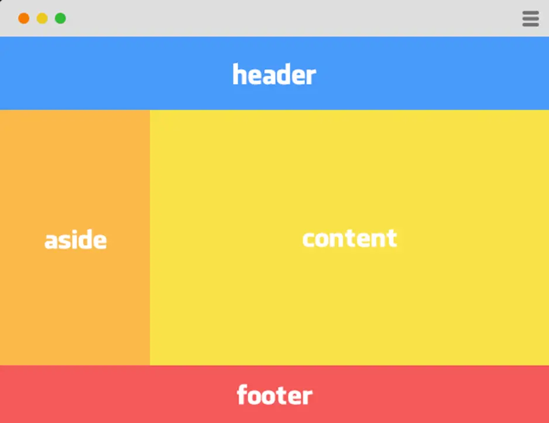

```html
<!DOCTYPE html>
<html lang="fa">
 
<head>
    <meta charset="UTF-8">
    <meta name="viewport" content="width=device-width, initial-scale=1.0">
    <title>Layout</title>
 
    <style>
        * {
            margin: 0;
            padding: 0;
            box-sizing: border-box;
        }
 
        .container {
            width: 100%;
            min-height: 100vh;
        }
 
        /* Header */
        .header {
            height: 100px;
            background: #4e8fe6;
        }
 
        /* Main Section */
        .main {
            display: flex;
            min-height: 500px;
        }
 
        .aside {
            width: 25%;
            background: #f0b64b;
        }
 
        .content {
            flex: 1;
            background: #ead846;
        }
 
        /* Footer */
        .footer {
            height: 100px;
            background: #f25a5a;
        }
 
        .header,
        .aside,
        .content,
        .footer {
            color: white;
            font-weight: bold;
            display: flex;
            align-items: center;
            justify-content: center;
            font-size: 42px;
        }
    </style>
</head>
<body>
    <div class="container">
        <div class="header">
            header
        </div>
        <div class="main">
            <div class="aside">
                aside
            </div>
            <div class="content">
                content
            </div>
        </div>
        <div class="footer">
            footer
        </div>
    </div>
</body>
</html>
```
## تگ های مفهومی
طراحان سایت و برنامه نویسان صفحه را به کمک تگ های  `header` و `main` و `footer` به چند بخش تقسیم می کنند و هر بخش را به کمک تگ `section` به چند زیر بخش. این tag ها مثل Div کاربرد container بودن هم دارند. مثل Div هم Block-level هستند. تفاوت آنها این است که Div برای ایجاد یک container والد که دارای چند فرزند است ایجاد می‌شود ولی این تگ ها برای جدا کردن بخش های مفهومی سایت استفاده می شوند که برای موتورهای جستجو و کاربران 
معنی
[^4]
 دارند. Screen reader ها هم تفسیر متفاوتی از این دو دارند.

[^4]:Semantic

```html
<section>
    <h2>محصولات</h2>
    ...
</section>
```
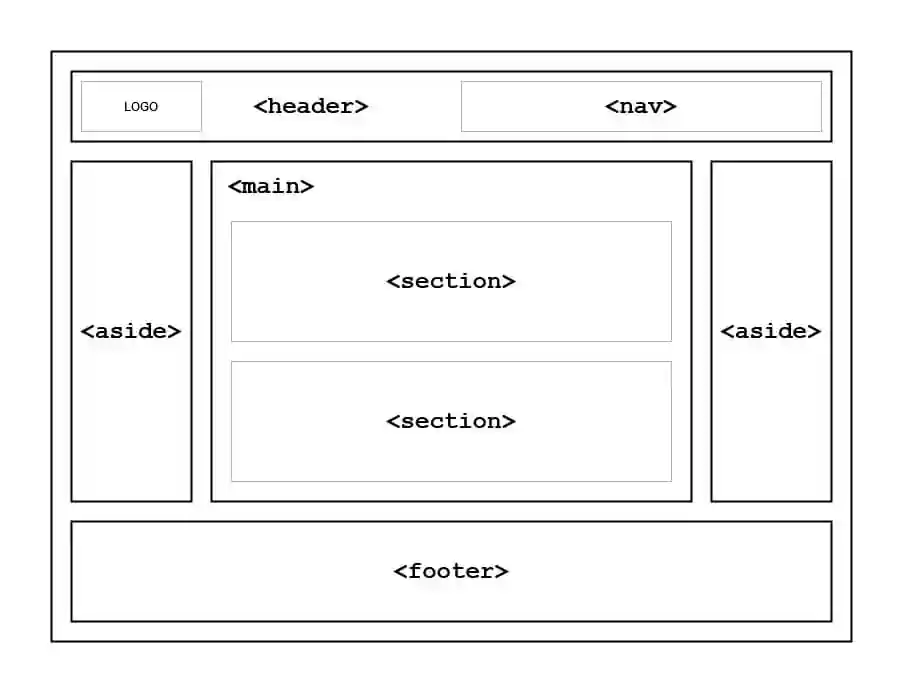

لیست تگهای مفهومی:

| **tag**     | **description**                                                                                          |
|-------------|----------------------------------------------------------------------------------------------------------|
| **header**  | سرآمد هر بخش                                                                                             |
| **nav**     | برای منوها و ناوبری[^5] در سایت استفاده می‌شود.                                                              |
| **main**    | بدنه اصلی سایت                                                                                           |
| **aside**   | نوارهای چپ و راست بدنه اصلی                                                                              |
| **section** | برای بخش بدنی هر یک از تگ های مفهومی دیگر استفاده می‌شود                                                 |
| **article** | برای نمایش قسمت هایی که ممکن است در جاهای مختلف سایت نمایش داده شوند مثل پست های وبلاگ یا انجمن یا اخبار |
| **footer**  | بخش پایینی سایت                                                                                          |

[^5]:navigation

## ol-ul-li
مخفف unordered list یعنی لیست بدون شماره از این تگ برای ایجاد لیست استفاده می‌شود. با تگ `li` اجزای این لیست را می توان اضافه کرد. برای لیست های شماره دار از تگ ol استفاده می‌شود. برای اجزایی مثل آیتم های لیست موجود در منوی سایت از `ul` استفاده می‌شود.

```html
<ol>
  <li>Coffee</li>
  <li>Tea</li>
  <li>Milk</li>
</ol>
```
:::{.ltr .output}
<ol>
  <li>Coffee</li>
  <li>Tea</li>
  <li>Milk</li>
</ol>
:::

```html
<ul>
  <li>Coffee</li>
  <li>Tea</li>
  <li>Milk</li>
</ul>
```

:::{.ltr .output}
<ul>
  <li>Coffee</li>
  <li>Tea</li>
  <li>Milk</li>
</ul>
:::

به کمک شبه المان ها می‌شود تغییراتی در آنها داد.

توسط خاصیت های مثل `padding` می توان فاصله آیتم ها از هم را تنظیم کرد.

از لیست ها برای ساخت منوهای سایت نیز می توان استفاده کرد.معمولا در ساخت منو ها خاصیت `list-style-type` را روی `none` قرار می‌دهند. 

```html
li {
	list-style: none;
	display: inline;
}

li:hover {
	background-color: orange;
	cursor: pointer;
}

ul {
	background-color: yellow;
	padding: 0;
}


<ul>
   <li>Home</li>
   <li>News</li>
   <li>Blog</li>
   <li style="float: right;">About</li>
</ul>
```

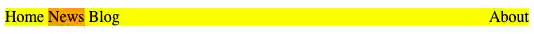

در کد بالا اگر خاصیت `display` را برابر با `block` کنیم منو تبدیل به منوی عموی خواهد شد که در پنل سمت جپ سایت ها کاربرد دارد.

مقادیر دیگری که  خاصیت `list-style` می تواند داشته باشد:


- Disc
- Circle
- Square
- Lower-alpha
- Lower-latin
- Lower-roman

## table
برای رسم جدول استفاده می‌شود.هر جدول دو نوع سلول دارد data و header که با دو تگ `<td>` برای table data و `<th>` برای table header مشخص می شوند. این دو نوع سلول باید در یک ردیف که با `<tr>` به معنی table row مشخص می‌شود قرار گیرند.

```html
<table>
  <tr>
    <th>Name</th>
    <th>Email</th>
    <th colspan="2">Phone</th>    
  </tr>
  <tr>
    <td>John Doe</td>
    <td>john.doe@example.com</td>    
    <td>123-45-678</td>
    <td>212-00-546</td>    
  </tr>
</table>
```

که خروجی آن به شکل زیر است:

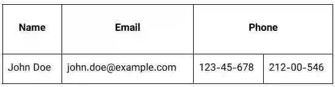

colspan (مخفف Column Span) به سلول می‌گوید که چند ستون را در عرض خودش پوشش دهد (اشغال کند). به عبارت دیگر، یک سلول را در چندین ستون پخش می‌کند.

- مقدار پیش‌فرض: 1 (یعنی سلول فقط یک ستون را اشغال می‌کند)

- مقدار مجاز: هر عدد صحیح مثبت (مثلاً 2، 3، 5 و ...)

```html
<table border="1">
    <tbody>
        <tr>
            <td>A</td>
            <td>B</td>
            <td>C</td>
        </tr>


        <tr>
            <td colspan="2">D</td>
            <td>E</td>
        </tr>
        <tr>
            <td>F</td>
            <td colspan="2">G</td>
        </tr>
    </tbody>
</table>
```


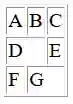

به هر یک از سلول ها یا به کل جدول می توان یک Style نسبت داد.
خاصیتی به نام `border-collapse` داریم که باعث می‌شود border های سلول ها به هم بچسبند.

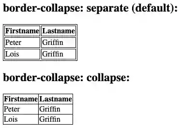

به کمک شبه کلاس‌ها می توان برای ردیف های even یا odd استایل خاصی را اعمال کرد.این کار به کمک متد nth-child انجام می‌شود:

```css
tr:nth-child(even){
    background-color:silver
}
```

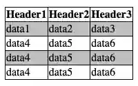

اگر به جای even بنویسیم 3n+1 به شکل زیر اعمال خواهد شد:

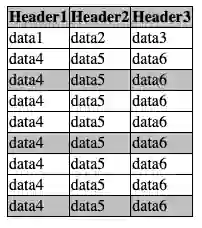

برای جداول بزرگ توصیه می‌شود برای اینکه در پرینت صفحات و اسکرول کردن صفحات کاربر راحت باشد سه بخش جدول (سرآمد-بدنه - پا جدول) را در سه تگ زیر قرار داد:

```html
<thead></thead>
<tbody></tbody>
<tfoot></tfoot>
```

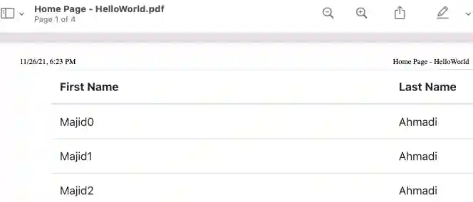

وقتی فایل بیش از یک صفحه باشد:

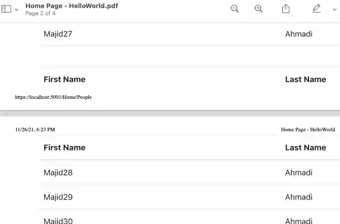

در bootstrap کلاس های table-striped و table-bordered برای شکل دهی سریع به جداول پرکاربرد هستند.

```html
<div class="container">
     <table></table>
     <thead></thead>
     <tbody></tbody>
     <tfoot></tfoot>


     <table class="table caption-top table-bordered">
       <caption>
         List of users
       </caption>
       <thead>
         <tr>
           <th scope="col">Name</th>
           <th>Email</th>
           <th colspan="2">Phone</th>
         </tr>
       </thead>
       <tbody>
         <tr>
           <td>John Doe</td>
           <td>john.doe@example.com</td>
           <td>123-45-678</td>
           <td>212-00-546</td>
         </tr>
       </tbody>
       <tfoot>
         <tr>
           <td colspan="4">Address:here</td>
         </tr>
       </tfoot>
     </table>
   </div>
```
با تگ `colgroup` می توان چند ستون را ادغام کرد. در کد از `colgroup` برای ادغام با هدف اعمال کلاس مشترک روی دو ستون آخر استفاده شده:

```html
<table>
    <caption>
        Personal weekly activities
    </caption>
    <colgroup span="5" class="weekdays"></colgroup>
    <colgroup span="2" class="weekend"></colgroup>
    <thead>
        <tr>
            <th>Mon</th>
            <th>Tue</th>
            <th>Wed</th>
            <th>Thu</th>
            <th>Fri</th>
            <th>Sat</th>
            <th>Sun</th>
        </tr>
    </thead>
    <tbody>
        <tr>
            <td>Clean room</td>
            <td>Football training</td>
            <td>Dance Course</td>
            <td>History Class</td>
            <td>Buy drinks</td>
            <td>Study hour</td>
            <td>Free time</td>
        </tr>
        <tr>
            <td>Yoga</td>
            <td>Chess Club</td>
            <td>Meet friends</td>
            <td>Gymnastics</td>
            <td>Birthday party</td>
            <td>Fishing trip</td>
            <td>Free time</td>
        </tr>
    </tbody>
</table>
```

```css
table {
    border-collapse: collapse;
    border: 2px solid rgb(140 140 140);
}


caption {
    caption-side: bottom;
    padding: 10px;
}


th,
td {
    border: 1px solid rgb(160 160 160);
    padding: 8px 6px;
    text-align: center;
}


.weekdays {
    background-color: #d7d9f2;
}


.weekend {
    background-color: #ffe8d4;
}
```

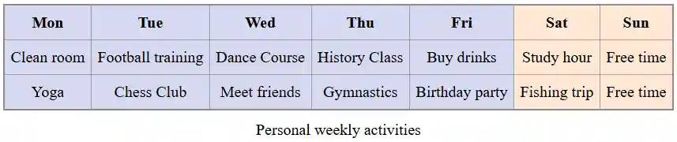

خصوصیت `span` در `<colgroup>` یک عدد صحیح مثبت دریافت می‌کند که نشان‌دهنده تعداد ستون‌هایی است که آن گروه شامل می‌شود . مثلاً 

```html
<colgroup span="5" class="weekdays"></colgroup>
<colgroup span="2" class="weekend"></colgroup>
```

یعنی یک گروه شامل 5 ستون (روزهای هفته) و یک گروه شامل 2 ستون (تعطیلات آخر هفته).

## dl dt dd
`dl` مخفف description list به معنی لیست توضیخات است. به همراه `dt` به معنی definition term  و `dd` به معنی difinition description برای درج توضیحات درباره هر آیتم استفاده می‌شود.

```html
<dl>
    <dt>Coffee</dt>
    <dd>Black hot drink</dd>
    <dt>Milk</dt>
    <dd>White cold drink</dd>
</dl>
```

:::{.ltr .CodeOutput}
<dl>
    <dt>Coffee</dt>
    <dd>Black hot drink</dd>
    <dt>Milk</dt>
    <dd>White cold drink</dd>
</dl>
:::


با استایل دهی به آن می توان مفاهیم را بهتر برای بازدید کننده تشریح کرد:

```css
    dt {
        font-weight: bold;
    }


    dl,
    dd {
        font-size: 0.9rem;
    }


    dd {
        margin-bottom: 1em;
    }
```

```html
<dl>
    <dt>Beast of Bodmin</dt>
    <dd>A large feline inhabiting Bodmin Moor.</dd>


    <dt>Morgawr</dt>
    <dd>A sea serpent.</dd>


    <dt>Owlman</dt>
    <dd>A giant owl-like creature.</dd>
</dl>
```
:::{.ltr .output}
<dl>
    <dt>Beast of Bodmin</dt>
    <dd style="margin-bottom: 1em;padding-left: 2rem;font-size: 0.9rem;">A large feline inhabiting Bodmin Moor.</dd>


    <dt>Morgawr</dt>
    <dd style="margin-bottom: 1em;padding-left: 2rem;font-size: 0.9rem;">A sea serpent.</dd>


    <dt>Owlman</dt>
    <dd style="margin-bottom: 1em;padding-left: 2rem;font-size: 0.9rem;">A giant owl-like creature.</dd>
</dl>
:::


## Text formatting

این تگ‌ها فقط ظاهر متن رو تغییر میدهند و معنای خاصی ندارند.


| **تگ**       | **کاربرد **                       | **مثال**                 | **نتیجه**                |
|--------------|-----------------------------------|--------------------------|--------------------------|
| **<b> **     | متن پررنگ (Bold)                  | <b>متن پررنگ</b>         | متن پررنگ                |
| **<i> **     | متن کج (Italic)                   | <i>متن کج</i>            | متن کج                   |
| **<u> **     | <u>متن زیرخط‌دار</u> (Underline)  | <u>متن زیرخط‌دار</u>     | <u>متن زیرخط‌دار</u>     |
| **<s> **     | ~~متن خط‌خورده~~ (Strikethrough)  | <s>متن خط‌خورده</s>      | ~~متن خط‌خورده~~         |
| **<small> ** | متن کوچک                          | <small>متن کوچک</small>  | <small>متن کوچک</small>  |

## Phrase tags

تگ های عبارتی HTML برای اهداف خاصی طراحی شده اند و قسمتی از متن را معنادار تعریف می کنند. مثلا معنی خاصی برای یک موتور جستجو یا یک موتور متن خوان دارند.

:::{.ltr}

| **تگ **            |                         **کاربرد **                   |        **مثال **               |      **نتیجه **                                 |
|-----------------|--------------------------------|-------------------------------------------------------|------------------------------------------------------|
|   `<strong>`    | متن بسیار مهم (اهمیت بالا)    | `<strong>مهم</strong>`                                | <strong>مهم</strong>                                 |
|   `<em>`        | تأکید (Emphasis)              | `<em>تأکید</em>`                                       | <em>تأکید</em>                                      |
|   `<mark>`      | <mark>متن هایلایت شده</mark>   | `<mark>هایلایت</mark>`                                 | <mark>هایلایت</mark>                                 |
|   `<del>`       | ~~متن حذف شده~~               | `<del>حذف شده</del>`                                  | <del>حذف شده</del>                                   |
|   `<ins>`       | <ins>متن اضافه شده</ins>      | `<ins>اضافه شده</ins>`                                | <ins>اضافه شده</ins>                                |
|   `<sub>`       | زیرنویس (مثل H₂O)             | `H<sub>2</sub>O`                                       | H<sub>2</sub>O                                       |
|   `<sup>`       | بالانویس (مثل m²)              | `m<sup>2</sup>`                                        | m<sup>2</sup>                                        |
|   `<code>`      | کد کامپیوتر                   | `<code>let x = 10;</code>`                             | <code>let x = 10;</code>                             |
|   `<kbd>`       | ورودی صفحه‌کلید                | `<kbd>Ctrl+S</kbd>`                                    | <kbd>Ctrl+S</kbd>                                    |
|   `<samp>`      | خروجی برنامه                  | `<samp>Error 404</samp>`                               | <samp>Error 404</samp>                               |
|   `<var>`       | متغیر ریاضی                   | `<var>x</var> = 5`                                     |<var>x</var> = 5                                      |
|   `<abbr>`      | مخفف                           | `<abbr title="HyperText Markup Language">HTML</abbr>`  | <abbr title="HyperText Markup Language">HTML</abbr>  |


:::

### strong
تگ strong که در دسته ی تگ های عبارتی یا Phrase می باشد ، تگی است که با استفاده از آن میتوان یک متن / محتوا را به صورت مهم یا متنی که دارای ارزش محتوایی می باشد نشان داد.از نظر شمایل خروجی آن مثل تگ b که برای bold کردن متن استفاده می‌شود است ولی کارکرد متفاوت دیگری نیز دارد. زمانی که محتوای مهمی داریم و میخواهیم به موتورهای جستجو اعلام کنیم که به این محتوا یا کلمه کلیدی اهمیت ویژه ای بدهد از تگ strong استفاده می‌کنیم و زمانی که محتوای ما محتوای مهمی نیست و تنها می‌خواهیم آن را ضخیم کنیم از تگ b استفاده می‌کنیم.تگ strong در سئو سایت دارای اهمیت است.

```html
<p>
  ... the most important rule, the rule you can never forget, no matter how much
  he cries, no matter how much he begs:
  <strong>never feed him after midnight</strong>.
</p>
```
:::{.ltr .output}
<p>
  ... the most important rule, the rule you can never forget, no matter how much
  he cries, no matter how much he begs:
  <strong>never feed him after midnight</strong>.
</p>
:::


### code
تگ code تگی است که ما با استفاده از آن میتوانیم یک تکه کد (معمولا کدهای کامپیوتری) را درون یک صفحه ی وب تعریف نماییم.

```html
<p>
  The <code>push()</code> method adds one or more elements to the end of an
  array and returns the new length of the array.
</p>
```
:::{.ltr .output}
<p>
  The <code>push()</code> method adds one or more elements to the end of an
  array and returns the new length of the array.
</p>
:::
می توان با استایل سفارشی کد ها را متمایز کرد.

### pre[^6]
برای نمایش متن ها دقیقا با همان حالت و فواصل استفاده می شود.

[^6]: Preformatted Text

```html
    <pre>
این    متن    با    فاصله‌های    زیاد
     و خط جدید
نشان داده میشه
</pre>
```

:::{.ltr .output}
<pre>
این    متن    با    فاصله‌های    زیاد
     و خط جدید
نشان داده میشه
</pre>
:::

متن داخل `<pre>`  [^7] با فونت ثابت‌عرض (مثل Courier) نمایش داده میشود.

[^7]:Monospace

`<code>` فقط برای نمایش تک‌خطی کد یا عبارت‌های کوتاه استفاده میشود و فاصله‌ها را حفظ نمیکند.
نکته مهم:اگر داخل `<pre>` از کاراکترهای خاص مثل < یا > استفاده میکنید، حتماً باید از Entity Codes (مثل &lt; برای بسته و &gt; برای باز) استفاده کنید تا مرورگر اون‌ها رو به‌عنوان تگ HTML تفسیر نکنه.

```html
<pre>
    <code>
function hello() {
    console.log("Hello World");
}
    </code>
</pre>

<pre>
    <span class="code-slash fade-in-element">TEST</span>
</pre>

<pre>
    &lt;span class="code-slash fade-in-element"&gt;TEST&lt;/span&gt;
</pre>

```
:::{.ltr .output}
<pre>
    <span class="code-slash fade-in-element">TEST</span>
</pre>

<pre>
    &lt;span class="code-slash fade-in-element"&gt;TEST&lt;/span&gt;
</pre>
:::
همانطور که مشاهده می شود span اول توسط مرورگر به عنوان تگ `span` تفسیر شده است.

### var
تگ var یا Variable که در دسته ی تگ های عبارتی یا ( Phrase ) قرار دارد، تگی است که با استفاده از آن می توان متغیر ها را در یک صفحه وب تعریف و یا ایجاد نمود. اگر با زبان های برنامه نویسی آشنایی داشته باشید میدانید که متغیرها چه هستند، حال همان متغیرها را اگر بخواهیم در یک صفحه وب بگذاریم باید از تگ Var استفاده نماییم.

```html
<p>
  The volume of a box is <var>l</var> × <var>w</var> × <var>h</var>, where
  <var>l</var> represents the length, <var>w</var> the width and
  <var>h</var> the height of the box.
</p>
```
:::{.ltr .output}
<p>
  The volume of a box is <var>l</var> × <var>w</var> × <var>h</var>, where
  <var>l</var> represents the length, <var>w</var> the width and
  <var>h</var> the height of the box.
</p>
:::

### kbd
تگ `kbd` که مخفف Keyboard Input می باشد تگی است که در دسته ی تگ های عبارتی یا Phrase می باشد ، با استفاده از آن میتوان یک ورودی صفحه کلید یا Keyboard Input را در یک صفحه وب قرار داد.

```html
<p>
  Please press <kbd>Ctrl</kbd> + <kbd>Shift</kbd> + <kbd>R</kbd> to re-render an
  MDN page.
</p>
```
:::{.ltr .output}
<p>
  Please press <kbd>Ctrl</kbd> + <kbd>Shift</kbd> + <kbd>R</kbd> to re-render an
  MDN page.
</p>
:::

مرورگر و موتورهای جستجو متن درون آن را به عنوان ترکیبی از کلیدهای کیبورد درک خواهند کرد.

```css
kbd {
	background-color: #123456;
	padding:.1rem .6rem;
	color: #fff;
}
```
```html
<p>
    Please press <kbd>Ctrl</kbd> + <kbd>Shift</kbd> + <kbd>R</kbd> to re-render
    page.
</p>
```
:::{.ltr .output}
<p>
    Please press <kbd style="            background-color: #123456;
    padding: .1rem .6rem;
    color: #fff;
    border-radius: .2rem;">Ctrl</kbd> + <kbd style="            background-color: #123456;
    padding: .1rem .6rem;
    color: #fff;
    border-radius: .2rem;">Shift</kbd> + <kbd style="            background-color: #123456;
    padding: .1rem .6rem;
    color: #fff;
    border-radius: .2rem;">R</kbd> to re-render
    page.
</p>
:::

### samp
تگ samp که مخفف Sample می باشد ، تگی است که در دسته ی تگ های عبارتی یا Phrase می باشد ، و با استفاده از آن می توان خروجی یک برنامه کامپیوتری را در یک صفحه وب قرار داد.

```html
<p>I was trying to boot my computer, but I got this hilarious message:</p>

<p>
  <samp>Keyboard not found <br />Press F1 to continue</samp>
</p>
```
:::{.ltr .output}
<p>I was trying to boot my computer, but I got this hilarious message:</p>

<p>
  <samp>Keyboard not found <br />Press F1 to continue</samp>
</p>
:::

### abbr

از تگ `<abbr>` برای اختصار سازی [^8] یک عبارت طولانی استفاده می‌شود.

[^8]: abbreviation

```html
<p>
    The <abbr title="World Health Organization">WHO</abbr> was founded in 1948.
</p>
```
:::{.ltr .output}
<p>
    The <abbr title="World Health Organization">WHO</abbr> was founded in 1948.
</p>
:::

### mark
برای برجسته و متمایز کردن قسمت خاصی از متن استفاده می‌شود.

```html
<p>Search results for "salamander":</p>

<hr />

<p>
    Several species of <mark>salamander</mark> inhabit the temperate rainforest of
    the Pacific Northwest.
</p>

<p>
    Most <mark>salamander</mark>s are nocturnal, and hunt for insects, worms, and
    other small creatures.
</p>
```

:::{.ltr .output}
<p>Search results for "salamander":</p>

<hr />

<p>
    Several species of <mark>salamander</mark> inhabit the temperate rainforest of
    the Pacific Northwest.
</p>

<p>
    Most <mark>salamander</mark>s are nocturnal, and hunt for insects, worms, and
    other small creatures.
</p>
:::

### dfn
این امکان می دهد را به شما می دهد تا کلمه کلیدی محتوا را مشخص کنید.

```html
<p>
  A <dfn id="def-validator">validator</dfn> is a program that checks for syntax
  errors in code or documents.
</p>

```
:::{.ltr .output}
<p>
  A <dfn id="def-validator">validator</dfn> is a program that checks for syntax
  errors in code or documents.
</p>

:::

### blockquote - cite - q
این تگ علاوه بر ظاهر، معنای معنایی (semantic) هم دارد و به مرورگرها، موتورهای جستجو و ابزارهای کمکی می‌گوید که این بخش یک نقل‌قول است.
```html
<div>
  <blockquote cite="https://www.huxley.net/bnw/four.html">
    <p>
      Words can be like X-rays, if you use them properly—they'll go through
      anything. You read and you're pierced.
    </p>
  </blockquote>
  <p>—Aldous Huxley, <cite>Brave New World</cite></p>
</div>

```

:::{.ltr .output}
<div>
  <blockquote cite="https://www.huxley.net/bnw/four.html">
    <p>
      Words can be like X-rays, if you use them properly—they'll go through
      anything. You read and you're pierced.
    </p>
  </blockquote>
  <p>—Aldous Huxley, <cite>Brave New World</cite></p>
</div>

:::

ویژگی `cite` به منبعی که از آن سایت نقل قول کرده ایم اشاره می کند. این آدرس به کاربر نمایش داده نمی شود اگر بخواهیم نمایش داده شود از تگ `cite` استفاده می کنیم:

برای نقل قول کوتاه از q استفاده می کنیم:

```html
<p>
  When Dave asks HAL to open the pod bay door, HAL answers:
  <q
    cite="https://www.imdb.com/title/tt0062622/quotes/?item=qt0396921&ref_=ext_shr_lnk">
    I'm sorry, Dave. I'm afraid I can't do that.
  </q>
</p>
```

:::{.ltr .output}
<p>
  When Dave asks HAL to open the pod bay door, HAL answers:
  <q
    cite="https://www.imdb.com/title/tt0062622/quotes/?item=qt0396921&ref_=ext_shr_lnk">
    I'm sorry, Dave. I'm afraid I can't do that.
  </q>
</p>
:::

### address
اطلاعات تماس نویسنده ی محتوا را تعیین می کند.

```html
<address>
   Written by <a href="mailto:webmaster@example.com">Jon Doe</a>.<br> 
   Visit us at:<br>
   Example.com<br>
   Box 564, Disneyland<br>
   USA
</address>

```

:::{.ltr .output}
<address>
   Written by <a href="mailto:webmaster@example.com">Jon Doe</a>.<br> 
   Visit us at:<br>
   Example.com<br>
   Box 564, Disneyland<br>
   USA
</address>
:::

### em
تگ `em` که از کلمه Emphasized گرفته شده و در دسته ی تگ های عبارتی یا Phrase می باشد ، تگی است که با استفاده از آن می توان روی یک متن / کلمه تاکید کرد.موتورهای جستجوگر ( مثل گوگل ) به این تگ توجه می کنند، تگ i نیز در ظاهر شبیه به تگ `em` می باشد ولی فرق دارند، تگ i هیچ گونه تاکیدی روی متن ندارد و فقط متن رو شکسته یا ایتالیک می کند. همچنین screen reader ها با رسیدن به این تگ متن درون آن را با تاکید قرائت می کنند.

```html
<p>Get out of bed <em>now</em>!</p>

<p>We <em>had</em> to do something about it.</p>

<p>This is <em>not</em> a drill!</p>
```

:::{.ltr .output}
<p>Get out of bed <em>now</em>!</p>

<p>We <em>had</em> to do something about it.</p>

<p>This is <em>not</em> a drill!</p>
:::

## img
برای درج تصویر در سایت استفاده می‌شود.چون محتوایی درون خود ندارد، یک تگ تهی [^9] محسوب می‌شود؛ یعنی تگ بسته (`</img>`) ندارد.

[^9]:Void Element

```html

```
اگر تصویر لود نشود یا کاربر از صفحه‌خوان استفاده کند، متن [^10]  `alt` نمایش داده یا خوانده می‌شود.

[^10]:Alternative Text

توصیه می شود در آدرس فایل های محلی حتما / قید شود تا اگر سایت روی سرور قرار گرفت مشکلی در یافتن فایل به وجود نیاید.
این تگ خاصیتی به نام loading دارد که در حالت پیش فرض مقدار آن `eager` است. در صورتی که مقدار آن روی `lazy` تنظیم شود فقط تصاویری دانلود می‌شوند که در محدوده قابل رویت یعنی viewport قرار دارند.

خاصیت  `title` باعث می شود در صورتی که کاربر ماوس را روی تصویر نگه داشت یک tooltip نمایش داده شود.

```html

```


می توان به وسیله `srcset` با توجه به سایز صفحه نمایش و یا رزولوشن مشخص کرد کدام عکس باز شود.sizes به مرورگر می‌گوید که تصویر در چه اندازه‌ای (بر اساس عرض صفحه) نمایش داده می‌شود تا مرورگر بهترین عکس را از بین لیست `srcset` انتخاب کند.

ویژگی `decoding` به مرورگر می گوید که چگونه تصویر را رمز گشایی کند. مقدار `async` باعث بهبود سرعت می شود.

```html

```

## figure - figcaption
عنصر `<figure>` در HTML نشان‌دهنده محتوای مستقلی است که احتمالاً دارای یک عنوان اختیاری است که با استفاده از عنصر `<figcaption>` مشخص می‌شود. شکل، عنوان آن و محتوای آن به عنوان یک واحد واحد ارجاع داده می‌شوند.

```html
figure {
  border: thin silver solid;
  display: flex;
  flex-flow: column;
  padding: 5px;
  max-width: 220px;
  margin: auto;
}

img {
  max-width: 220px;
  max-height: 150px;
}

figcaption {
  background-color: #222222;
  color: white;
  font: italic smaller sans-serif;
  padding: 3px;
  text-align: center;
}

```
معمولاً یک `<figure>` یک تصویر، تصویرسازی، نمودار، قطعه کد و غیره است که در جریان اصلی یک سند به آن ارجاع داده می‌شود، اما می‌توان آن را بدون تأثیر بر جریان اصلی به بخش دیگری از سند یا به یک پیوست منتقل کرد.

یک عنوان را می‌توان با قرار دادن یک `<figcaption>` درون عنصر `<figure>` (به عنوان اولین یا آخرین فرزند) به آن مرتبط کرد. اولین عنصر `<figcaption>` که در شکل یافت می‌شود، به عنوان عنوان شکل نمایش داده می‌شود.

`<figcaption>` نام قابل دسترسی برای `<figure>` والد را فراهم می‌کند.

## area
به کمک این تگ می توان محدوده های قابل کلیکی در یک تصویر به وجود آورد.

```html
<map name="infographic">
  <area
    shape="poly"
    coords="129,0,260,95,129,138"
    href="https://developer.mozilla.org/docs/Web/HTTP"
    alt="HTTP" />
  <area
    shape="poly"
    coords="260,96,209,249,130,138"
    href="https://developer.mozilla.org/docs/Web/HTML"
    alt="HTML" />
  <area
    shape="poly"
    coords="209,249,49,249,130,139"
    href="https://developer.mozilla.org/docs/Web/JavaScript"
    alt="JavaScript" />
  <area
    shape="poly"
    coords="48,249,0,96,129,138"
    href="https://developer.mozilla.org/docs/Web/API"
    alt="Web APIs" />
  <area
    shape="poly"
    coords="0,95,128,0,128,137"
    href="https://developer.mozilla.org/docs/Web/CSS"
    alt="CSS" />
</map>


</map>
```

:::{.output}
<p style="text-align:left;">hover mouse on image</p>
<map name="infographic">
  <area
    shape="poly"
    coords="129,0,260,95,129,138"
    href="https://developer.mozilla.org/docs/Web/HTTP"
    alt="HTTP" />
  <area
    shape="poly"
    coords="260,96,209,249,130,138"
    href="https://developer.mozilla.org/docs/Web/HTML"
    alt="HTML" />
  <area
    shape="poly"
    coords="209,249,49,249,130,139"
    href="https://developer.mozilla.org/docs/Web/JavaScript"
    alt="JavaScript" />
  <area
    shape="poly"
    coords="48,249,0,96,129,138"
    href="https://developer.mozilla.org/docs/Web/API"
    alt="Web APIs" />
  <area
    shape="poly"
    coords="0,95,128,0,128,137"
    href="https://developer.mozilla.org/docs/Web/CSS"
    alt="CSS" />
</map>
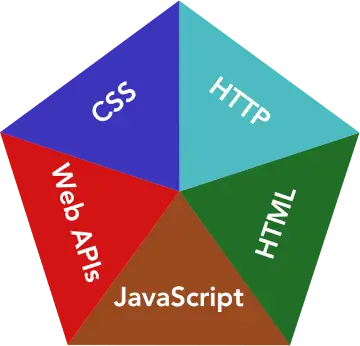
:::

برای `shape` می توان از مقدار `poly` برای ترسیم دقیق تر استفاده کرد.

## audio
برای درج پلیر صوتی در صفحه استفاده می‌شود.

```html
<audio controls>
  <source src="horse.ogg" type="audio/ogg">
  <source src="horse.mp3" type="audio/mpeg">
  Your browser does not support the audio tag.
</audio>
```

## video
برای نمایش پخش کننده فیلم:

```html
<video width="320" height="240" controls>
   <source src="movie.mp4" type="video/mp4">
   <source src="movie.ogg" type="video/ogg">
   <source src="movie.WebM" type="video/webm">
   Your browser does not support the video tag.
</video>
```
درج باعث `controls` می‌شود  کنترل کننده های فیلم در صفحه player نمایش داده شوند.Autoplay و muted   و poster موارد دیگری است که می توان استفاده کرد. Poster درواقع cover فیلم قبل از شروع نمایش آن است.
خاصیتی به نام `preload` می توان در این تگ استفاده کرد که مشخص می کند load ویدئو بعد از زدن دکمه play شروع شود یا همزمان با باز شدن سایت cache  کردن فیلم آغاز شود.مقادیر آن:

- None
- Metadata - download film preview metadata
- Auto

```html
<video width="320" height="240" preload=”auto”>
```
اگر autoplay را فعال کرده باشید این خاصیت بی تاثیر خواهد بود.
روش دیگر استفاده از iframe است:

```html
<iframe width="420" height="315"
src="https://www.youtube.com/embed/tgbNymZ7vqY?autoplay=1&mute=1&loop=1&playlist=tgbNymZ7vqY&controls=0">
</iframe>
```
در url فوق بعد از علامت ؟ پارامترهای زیر که بینشان & درج شده است استفاده شده اند:

:::{.ltr}
- Autoplay	(for start playing after page load. Not work on chromium browsers)
- Loop 		(for loop video after it ends)
- Mute		(for start playing muted)
- Playlist		(open specific playlist)
:::

می توان پارامترهای زیر را نیز اضافه کرد:

:::{.ltr}
frameborder=0

cc_lang_pref=fa

cc_load_policy = 1

For Default caption
:::

## iframe

