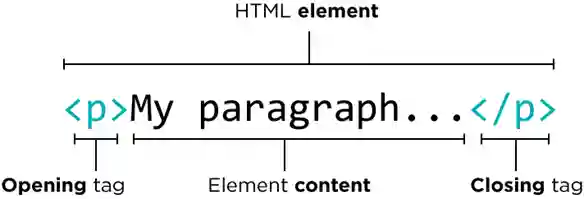

# مقدمه
html یک زبان استاندارد **نشانه گذاری** سمت کاربر است که از آن برای ایجاد صفحات وب و برنامه‌های کاربردی وب، با استفاده از CSS و جاوا اسکریپت استفاده می‌کنند.
مرورگرهای وب اسناد HTML را از یک سرور وب یا از سیستم رایانه دریافت می کنند و اسناد را به صفحات وب چندرسانه ای تبدیل می کنند. عناصر HTML ساختار یک صفحه وب را توصیف می کنند و در اصل شامل نشانه هایی برای ظاهر سند هستند.

تاکنون نسخه هایی از آن منتشر شده است که **html5** آخرین نسخه از آن می باشد.

ساختار تگ های HTML به این صورت است:

```html
<tag>
  ...
</tag>
```
مثلا:



که داخل کاراکتر های باز و بسته نام عناصر و داخل تگ محتوای آن قرار می گیرد.تگ های HTML معمولا به صورت جفتی مانند <p> و </ p> قرار می گیرند. اولین تگ در یک جفت تگ شروع است، برچسب دوم تگ پایان است. تگ پایان مانند تگ شروع بوده، اما قبل از اسم تگ وارد شده است.گاهی نیز به شکل </> استفاده شده و اصطلاحا **self close** هستند مثلا:


```html
<input />
```

در HTML5 وجود slash آخر نیز اختیاری است.
ساختار یک فایل html به شکل زیر است:


```html
<!DOCTYPE html>
<html lang="en-US">
   <head>
      <title>Page title</title>
      <meta charset="utf-8" />
      <meta name="viewport" content="width=device-width,initial-scale=1.0" />
      <link rel="icon" type="image/x-icon" href="img/favicon.ico" />
      <link rel="stylesheet" href="style.css" />
   </head>
   <body>
      <!-- page contents goes here -->
      <script type="text/javascript" src="js/script.js"></script>
   </body>
</html>

```