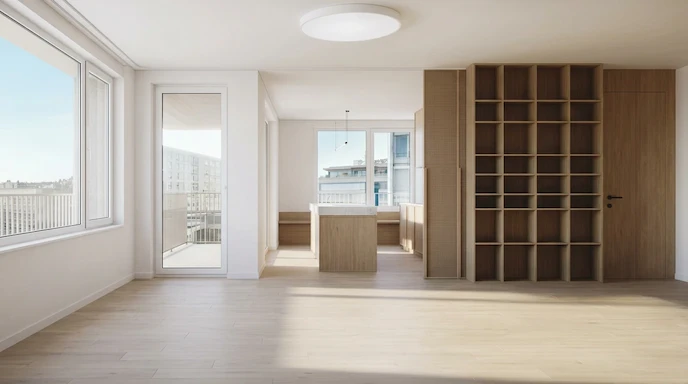
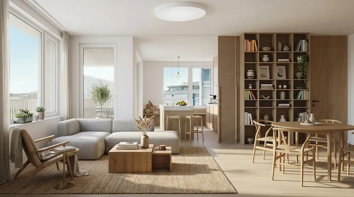

# Before/After Comparison Slider
```{=html}
<div class="comparison-container">
    
    

    <div class="handle"></div>
    <input type="range" min="0" max="100" value="50" oninput="event.target.parentElement.style.setProperty('--pos', event.target.value);">
</div>
```

اسلایدرهای مقایسه قبل/بعد، اجزای رابط کاربری بسیار محبوبی برای نمایش تغییرات بصری هستند. چه برای نمایش روتوش عکس، چه برای نمایش بازسازی قبل/بعد، یا تفاوت بین دو نسخه طراحی، این الگو تعاملی شهودی و جذاب ارائه می‌دهد.
ساختار یک اسلایدر مقایسه‌ای بر دو لایه روی هم قرار گرفته متکی است: تصویر «بعد» در پس‌زمینه و تصویر «قبل» در بالا، که به لطف یک ماسک CSS تا حدی قابل مشاهده است. یک دسته به کاربر اجازه می‌دهد ناحیه آشکار شده را کنترل کند.

نکات ساختاری کلیدی
ترتیب لایه‌ها : تصویر «بعد» در DOM اول می‌آید اما به لطف `z-index` پشت سر قرار می‌گیرد.
موقعیت نسبی : کانتینر والد باید طوری تنظیم شود `position: relative`که فرزندان مطلق به درستی در موقعیت قرار گیرند.
نسبت ابعاد : ارتفاع ثابتی را تنظیم کنید یا aspect-ratioبرای حفظ تناسبات از آن استفاده کنید
پنهان کردن سرریز : برای پنهان کردن قسمت‌های سرریز شده تصاویر ضروری است.
ویژگی CSS `clip-path` کلید این کامپوننت است. این ویژگی به شما امکان می‌دهد یک ناحیه قابل مشاهده برای یک عنصر تعریف کنید و هر چیزی را که خارج از آن است پنهان کنید. برای اسلایدر ما، از این ویژگی استفاده می‌کنیم `inset`()که مانند یک قاب داخلی عمل می‌کند.

این inset()تابع به ترتیب ۴ مقدار می‌گیرد: بالا، راست، پایین، چپ (مانند حاشیه‌ها). این مقادیر فاصله هر لبه به سمت داخل را تعریف می‌کنند:

inset(0 50% 0 0)۵۰٪ از سمت راست را می‌پوشاند و نیمه چپ را نشان می‌دهد.
inset(0 0 0 0)بدون ماسک، تصویر کاملاً قابل مشاهده است
inset(0 100% 0 0)همه چیز را از سمت راست می‌پوشاند، تصویر نامرئی می‌شود
حالا، بیایید تعامل جاوا اسکریپت را اضافه کنیم. دسته باید مکان‌نمای کاربر را دنبال کند و clip-pathبه صورت بلادرنگ به‌روزرسانی شود. ما باید رویدادهای mousedown، mousemove و mouseup را مدیریت کنیم.

برای ایجاد اسلایدر عمودی فقط باید clip-pathموقعیت دسته و دستگیره را تنظیم کنید. این نسخه برای مقایسه‌های عمودی یا جدول زمانی عالی است. فقط کافی است به جای 
```css
clip-path: inset(0 calc((100 - var(--pos)) * 1%) 0 0);
```
از
```css
clip-path: inset(calc((100 - var(--pos)) * 1%) 0 0 0);
```
استفاده کنید.
یک رویکرد زیبا برای استفاده کمتر از جاوا اسکریپت شامل به کار بردن  یک
 <bdi>`<input type="range">`</bdi>
  به شکل یک لایه نامرئی روی اسلایدر است. کاربر با
  محدوده بومی تعامل دارد و ما از متغیرهای CSS برای به‌روزرسانی نمایش استفاده می‌کنیم. <bdi>
 `<input type="range">`
 </bdi>
   یک کنترل بومی مرورگر است و خودش از رویدادهای:

- Mouse (mousedown, mousemove)
- Touch (touchstart, touchmove)
- Pointer events

پشتیبانی می‌کند. لذا نیاز نداریم رویدادهای 
mouse
 را برای 
 touch
  صفحه های لمسی نیز شبیه سازی کنیم.
رویداد oninput کمی جاوا اسکریپت دارد.

```html
<div class="comparison-container">
    
    

    <div class="handle"></div>
    <input type="range" min="0" max="100" value="50" oninput="event.target.parentElement.style.setProperty('--pos', event.target.value);">
</div>
```

```css
/* ظرف اصلی که دو تصویر را در خود نگه می‌دارد */
.comparison-container {
    /* برای سایت هایی که rtl هستند */
    direction: ltr;
    position: relative;
    overflow: hidden;
    /* وسط چین کردن */
    margin: 0 auto;
    /* این متغیر همزمان با تغییر input tag تغییر خواهد کرد */
    --pos: 50;
}

.comparison-container .before {
    /* برای اینکه دو تصویر روی هم بیفتند */
    position: absolute;
    clip-path: inset(0 calc((100 - var(--pos)) * 1%) 0 0);
}

.comparison-container .handle {
    left: calc(var(--pos) * 1%);
}

.comparison-container input[type="range"] {
    position: absolute;
    inset: 0;
    width: 100%;
    height: 100%;
    margin: 0;
    /* نامرئی کردن input */
    opacity: 0;
    cursor: ew-resize;
    z-index: 20;
    -webkit-appearance: none;
}

.comparison-container .handle {
    position: absolute;
    top: 0;
    left: calc(var(--pos) * 1%);
    width: 3px;
    height: 100%;
    background: white;
    transform: translateX(-50%);
    z-index: 10;

    pointer-events: none;

    box-shadow: 0 0 5px rgba(0, 0, 0, .5);
}

/* رسم خط اسلایدر در وسط تصویر */
.comparison-container .handle::before {
    content: "↔";

    position: absolute;
    top: 50%;
    left: 50%;

    width: 44px;
    height: 44px;

    transform: translate(-50%, -50%);

    border-radius: 50%;

    background: white;
    color: #333;

    display: flex;
    align-items: center;
    justify-content: center;

    font-size: 24px;
    font-weight: bold;

    box-shadow: 0 2px 8px rgba(0, 0, 0, .35);
}
```